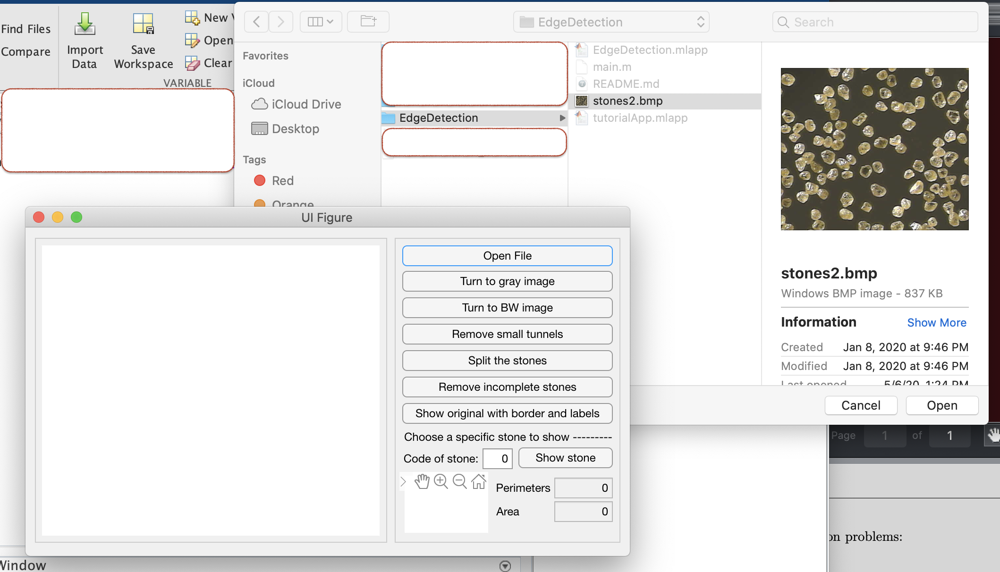
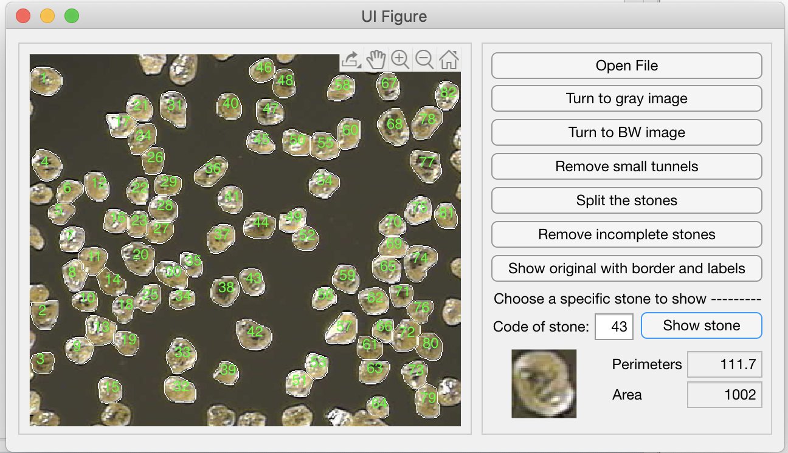

# EdgeDetection
This is a project using traditional image processing method to detect the edge of stones in the sample image.  

Canny Edge Detection, Watershed algorithm along with Machine Learning algorithm K-Means are used here.  

In this project, no training sample is required but I am afraid that the background of the picture should be quite similar to the sample one, which is plain and shares a totally different color from the stone.  

And here are some demonstrations of the project, where you can achieve the same result by running the [EdgeDetection.mlapp](https://github.com/FloraSun9101/EdgeDetection/blob/master/EdgeDetection.mlapp) file and click the buttons one by one from top to bottom. Then the pic in the left window will show how this is achieved step by step.  

Finally the stones will be marked out by white lines and will be labels. Besides, users can select the stones by the coded number and the perimeter and the area of the stone in pixels will be given.  

  
  
